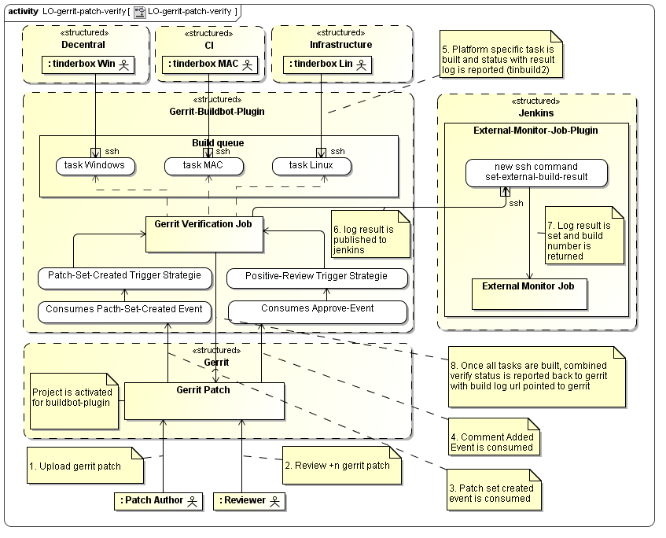

@PLUGIN@ overview
=================

Buildbot Gerrit Plugin (BGP) is a multi project and multi platform queue manager
for gerrit patch verification.

It coordinates the decentral located tinderboxes without having a continued
network connection to them by maintaining project and platform specific working
queue of tasks for each gerrit patch. A patch set considered to be verified
if and only if all tinderbox tasks are reported success back.
In this case `verified` status is reported back to gerrit.
In addition log publication is provided by delegating the log to jenkins
instance.

Workflow
--------

* During BGP activation the configuration file buildbot.config is read and
  gerrit-stream event listener is installed.
  Depending on trigger strategie for specific project, build is triggered.
* tinderbox that configured gerrit verification
  periodically calls BGP `get` ssh command and pick gerrit
  patch for verification. Note that because of blocking
  queue only one tinderbox per gerrit patch and per platform get engaged.
  When a tinderbox assigned a test build this event is repported as a review
  message.
* tinderbox build the recieved gerrit task and report the outcome and the
  the log file with BGP `put` ssh command. When a tinderbox outcome is known,
  report that in a review message (success, failed, cancelled).
  If --state=canceled is reported, then the task is rescheduled again in the 
  build queue.
* Once all tasks for a job are ready, the combined verify result is reported
  back to gerrit.

Discarding pending tasks
------------------------

Once one platform reports failure, all pending tasks for other platforms are
discarded from the queue.

Handle stale patch sets
-----------------------

When during patch verification a new patch set is submittedto gerrit, then all
pending tasks are discarded, and the running tasks only report single status
to gerrit, no combined status is set in that case.

Forge reviewer identity
-----------------------

Per default a review is reported back to gerrit with buildbot own identity,
iow so called "forge reviewer identity" feature is activated per default.
It can be overriden (setting configure option `user.forgeReviewerIdentity`
to `false`) to report a review with caller's own identity.

Mutliple branch support
-------------------------

Multiple branches per project are supported. A branch must be configured in
`project.NAME.branch` to be considered for build.

Skipping pending build task
---------------------------

With per project and per branch option `project.PROJECT_NAME.branch.BRANCH_NAME.policy`
`soft` or `strict` outcome reporting policy can be configured. If 
`project.PROJECT_NAME.branch.BRANCH_NAME.policy` is set to `soft` then
build is skipped for pending tasks in the platform specific queue once result
for one (or more) build task(s) is reported. With the option 
`project.PROJECT_NAME.branch.BRANCH_NAME.skipThreshold` the min. number of reported
result can be configured. Default is 1.

Example: build for platform `MAC` is ready and result is reported by `put` command.
Build on `Linux` platform is still runnning, and `Windows` platform is pending.
Now `Linux` platform is ready and is reported by `put`command: when `Windows` task
ist still pending, then it is skipped: the task is dropped from `Windows` queue and
combined status `+1` is reported back to gerrit.

SEE ALSO
--------

* [config](config-buildbot.html)
* [get](cmd-get.html)
* [put](cmd-put.html)
* [schedule](cmd-schedule.html)
* [show](cmd-show.html)

AUTHOR
------
David Ostrovsky

RESOURCES
---------
<https://github.com/davido/gerrit-buildbot-plugin>

Buildbot
--------
Part of [Gerrit Buildbot Plugin](index.html)